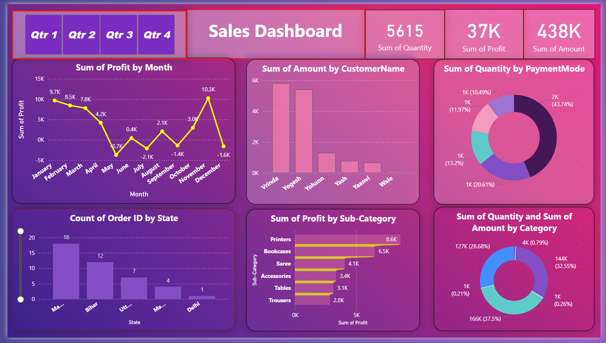

# Sales Dashboard

This dashboard provides insights into sales data across various categories:
- Order count by month
- Total quantity and profit
- Amount by customer
- Quantity by payment mode
- Order count by sub-category

Each chart helps to visualize sales performance, payment preferences, and popular items.

